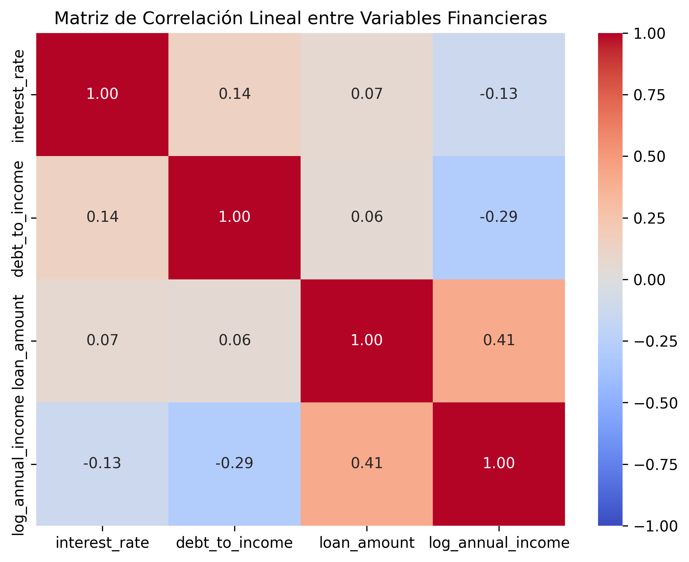
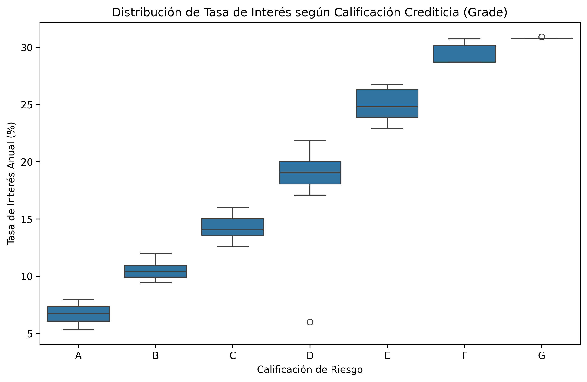
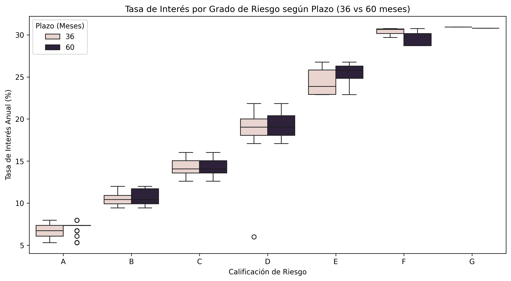

#  Credit Risk & Loan Pricing Analysis (LendingClub)

Análisis empírico y modelado econométrico de la política de **fijación de precios basada en el riesgo (*Risk-Based Pricing*)** en el mercado de crédito personal, utilizando datos de la plataforma LendingClub.

---

## 1. Contexto y Pregunta de Negocio
El objetivo de este proyecto fue investigar cómo una institución financiera determina la Tasa Nominal Anual (TNA) cobrada a sus prestatarios y en qué medida las variables de solvencia, condiciones contractuales y la nota crediticia interna explican la dispersión del costo del financiamiento.

> **Pregunta principal:** *¿En qué medida el scoring crediticio, la relación deuda/ingreso (DTI), el plazo contractual y el nivel de ingresos determinan algorítmicamente el precio del crédito al consumo?*

---

## 2. Datos y Preparación Técnica
Se trabajó con un portfolio de **10.000 solicitudes de crédito otorgadas** y 55 variables. Se aplicó el siguiente tratamiento de datos:

* **Tratamiento de Valores Nulos:**
  * `debt_to_income` (DTI): Se identificaron 24 observaciones nulas (0,24% del total). Al ser estadísticamente marginal, se eliminaron sin riesgo de sesgo muestral.
  * `emp_length` (antigüedad laboral): Presentaba 817 registros faltantes (~8,2%). No se eliminaron para evitar un **sesgo de selección sistemático**, ya que suele concentrar a freelancers, autónomos o recién empleados.
* **Transformación Logarítmica:**
  * El ingreso anual (`annual_income`) presentaba una severa asimetría hacia la derecha (mediana de \$65.000 vs. un máximo de \$2,3 millones). 
  * Se aplicó la transformación $\ln(\text{Ingreso})$ para estabilizar la varianza, corregir la asimetría y neutralizar el apalancamiento de valores atípicos (*outliers*).

### Correlación entre Variables Financieras Continuas
Antes de modelar, se evaluaron las relaciones lineales iniciales:

  

*Se observa correlación esperada pero moderada con la tasa: positiva para endeudamiento (DTI: 0,14) y negativa para ingreso (-0,13), evidenciando que ninguna variable continua aislada define el precio del crédito.*

---

## 3. Hallazgos Cuantitativos y Resultados Econométricos

A través de regresiones lineales por MCO (OLS) en `statsmodels`, se estimaron los efectos marginales bajo la condición ***Ceteris Paribus***:

### A. La Supremacía del Scoring Crediticio
La calificación interna (`grade`) es el principal determinante del costo financiero. 
* Un prestatario de **Grado B paga 3,72 puntos porcentuales (372 bps) más** de tasa que uno de Grado A.
* Para el **Grado G**, la penalización escala a **+23,88 puntos porcentuales (+2.388 bps)** respecto al Grado A, evidenciando una curva de prima de riesgo marcadamente convexa.

  

### B. Prima por Plazo y Liquidez (36 vs 60 meses)
Controlando por nivel de riesgo, ingreso y monto, extender el plazo de 3 años a 5 años (+24 meses) tiene un costo adicional de **4,10 puntos porcentuales (410 bps)** de tasa, compensando a la entidad por el costo de oportunidad y la incertidumbre temporal.

  

### C. Capacidad Explicativa del Modelo ($R^2$)
* **Modelo Simple ($DTI$):** $R^2 = 2,0\%$ (sesgo masivo por variable omitida).
* **Modelo Multivariado de Fundamentales ($DTI + \ln(\text{Ingreso}) + \text{Monto} + \text{Plazo}$):** $R^2 = 16,1\%$.
* **Modelo Completo con Dummies de Scoring (`grade`):** $R^2 = 95,0\%$.

> **Conclusión de gobernanza corporativa:** Un $R^2$ del 95% prueba empíricamente que la entidad opera bajo un **esquema de pricing algorítmico y reglado**. La tasa de interés no responde a discrecionalidad humana, sino a parámetros estandarizados según el score de riesgo.

---

## 4. Limitaciones Metodológicas y Recomendaciones

1. **Supuesto de Linealidad en el DTI:**
   * El modelo MCO asume un incremento constante (+3 bps por punto de DTI). En la práctica bancaria, pasar de 10% a 20% de DTI no incrementa el riesgo de impago al mismo ritmo que pasar de 50% a 60%. Se sugiere implementar modelos no lineales o segmentación por tramos (*splines*).
2. **Sesgo de Selección Truncada (Heckman Bias):**
   * El dataset solo contiene **créditos aprobados**. Quienes presentaban combinaciones inviables de riesgo fueron rechazados en la instancia previa. Incorporar datos de solicitudes rechazadas mediante un modelo de dos etapas (Probit + Heckman OLS) permitiría capturar la curva de riesgo completa del mercado.

---

##  Tecnologías y Librerías Utilizadas
* **Lenguaje:** Python 3.10+
* **Procesamiento de datos:** `pandas`, `numpy`
* **Visualización:** `matplotlib`, `seaborn`
* **Modelado Econométrico:** `statsmodels` (Mínimos Cuadrados Ordinarios - OLS)
